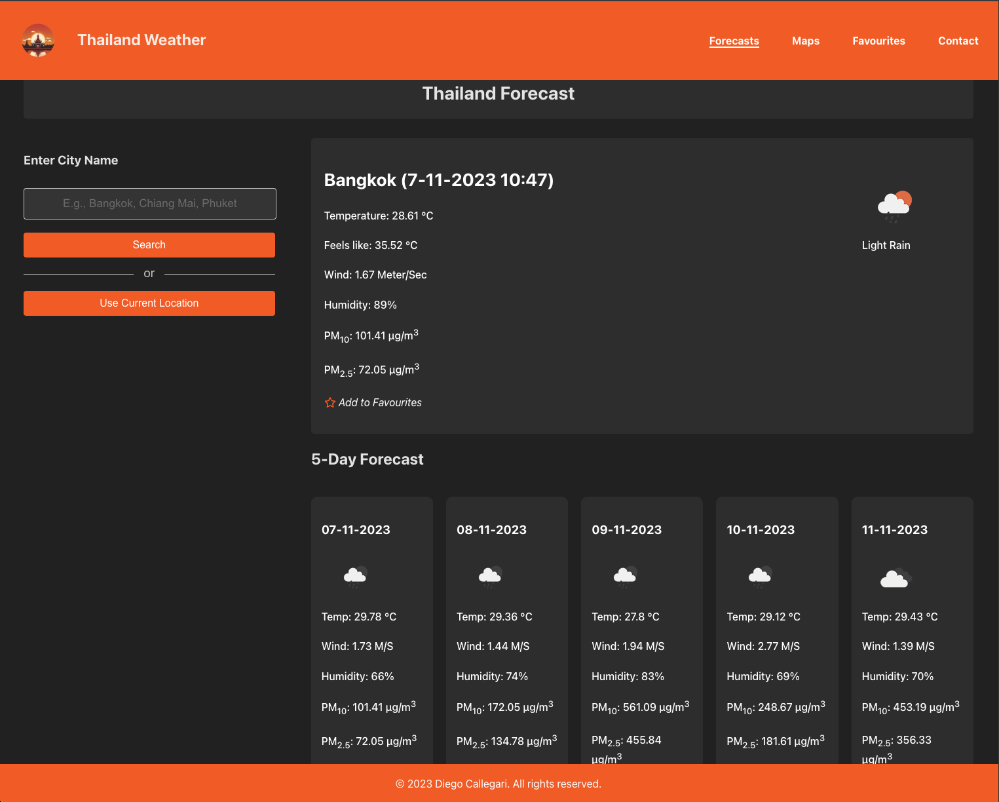

# Thailand WeatherApplication

Welcome to Thailand WeatherApplication. This website allows you to access weather information for various cities and villages across Thailand. Upon registering, you can enhance your experience by adding locations to your favorites list and conveniently managing them


## Screenshots




## Features

- Current Weather
- 5-Day Forecasts
- Use Current Location
- Add Locations To Your Favourites
- Maps Updated Every Hour


## Installation

Install my-project with npm

```bash
  npm install my-project
  cd my-project
```
    
## Environment Variables

To run this project, you will need to add the following environment variables to your .env file

`VITE_API_KEY` 78bc08d8f3b87079b6ae5563af0efd2e


## Acknowledgements

 - [Weather Data](https://openweathermap.org/)
 - [Icons](https://fontawesome.com/)
 - [ReadMe Template](https://readme.so/)


## Authors

- [Diego Callegari](https://github.com/diegocallegari96)

